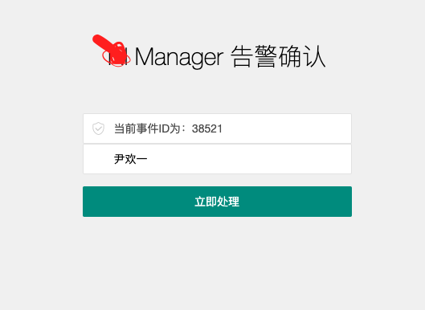
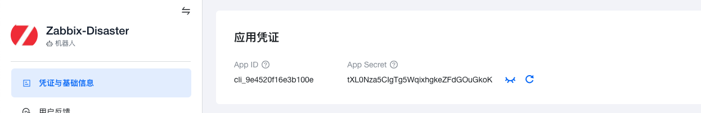

###  （一）zabbix-feishu-alert 模块使用方法

> **`(一)：安装`**

- 从 PYPI 安装

```
pip install -U  zabbix-feishu-alert
```

- 从 Github 安装

```
pip isntall git+https://github.com/yinhuanyi/zabbix-feishu-alert.git
```

> **`(二)：使用方法`**

```
from zabbix_feishu_alert import FeishuMessage

# 第一个参数：100.99.1.3为你的zabbix serverIP地址
# 第二个参数：Admin为你的zabbix web登录用户名
# 第三个参数：zabbix为你的zabbix web登录密码
# 第四个参数：13970236751为被@人的手机号码
# 第五个参数：36836为监控item的item id
# 第六个参数：zabbix graph存储路径
# 第七个参数：飞书机器人的app_id
# 第八个参数：飞书机器人的app_secret
feishu = FeishuMessage('100.99.1.3',
                       'Admin',
                       'zabbix',
                       '13970236751',
                       36836,
                       './',
                       'cli_9e44d8e26dbb500d',
                       '8X4jX9MLwg6AXIEVJh0lC8oeHNDBfbnd')

# 第一个和第二个参数为：发送告警信息的时候，需要获取到zabbix中的title信息和message信息
# 第三个参数：38524是此次告警的event_id
# 第四个参数：http://100.112.2.11:8000/monitor/problem_ack/是[立即处理]按钮发送ACK消息webhook的地址
feishu.send_alarm_message("Zabbix Alert Title",
                          "Zabbix Alert Content",
                          38524,
                          'http://100.112.2.11:8000/monitor/problem_ack/')

# 发送确认告警消息
feishu.send_ack_message("Zabbix Ack Title", 
                        "Zabbix Ack Title")

# 发送恢复告警消息
feishu.send_recovery_message("Zabbix Recovery Title", 
                             "Zabbix Recovery Title")
```

> **`(三)：告警效果`**

- 测试效果


- 真实接入zabbix之后的效果


> **`(四)：点击[立即处理]按钮`**

- 当值班人被@后，需要点击立即处理，立即处理会跳转到企业内部的运维平台，记录告警人的基本信息，例如：姓名，处理告警的时间等




###  （二）飞书机器人的创建

> **`(一)：登录飞书开放平台`**

- 登录飞书开放

[飞书开放平台](https://open.feishu.cn/)

- 在我的应用中，点击创建企业自建应用

- 在应用凭证栏中，可以看到APP ID和App Secret



# 欢迎提交PR